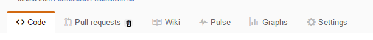
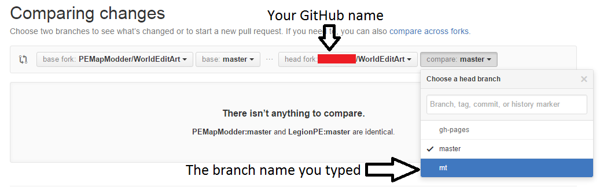

WorldEditArt contribution guidelines
===

## Issues
You can find the issue tracker [here](../../issues).

#### I have a question
For support, please go to the chatroom at [](https://gitter.im/PEMapModder/WorldEditArt). The issue tracker is for tracking issues on the plugin itself, not tracking support questions.

#### I want to help with translating
First of all, thank you so much for your help.

To correctly translate, please do these step by step:

1. [Register a GitHub account](/join), if you haven't already done so.
1. [Fork](../../fork) this repo.

1. Visit the fork. You will see something like this. .
1. Click the `Branch: master` button and type `mt` (or any names you like, as long as it is short and easy to type). A button below, `Create branch: mt`, will appear.
1. Navigate to the `resources` folder, then the `lang` folder, in your fork.
1. Check if your language's JSON file already exists. Read [this](#language-naming-scheme) for explanation on how to select language codes. If it doesn't already exist:
  1. Copy the contents of `en.json`. You can use the [raw](../../raw/master/resources/lang/en.json) mode to make copying easier.
  1. Find the `New file` button at the top in the `lang` page. Click it.
  1. Type the correct filename (the language code) at the top. Remember to end it with `.json`.
  1. Paste the contents in `en.json` into the file.
  1. Update `meta` `language` `value` (should be on line 4) from `en` to the language code. You don't need to type `.json` this time, of course.
  1. Change `meta` `language` `updated` into `1.0`.
  1. Change `meta` `native` `value` into the word you call it in your language. For example, `italiano` for Italian, `Монгол` for Mongolian, `Русский` for Russia, `繁體中文` for Traditional Chinese, etc. Please attach as much information as the language code contains, no less and no more.
  1. `meta` `native` `value` should not be changed. It should refer to the latest English translation version it is updated to, which is already that version.
  1. Change the value in `meta` `authors` `value` from `PEMapModder` into your name.
  1. Translate the existing "phrases" them one by one. You don't need to translate the ones under the `meta` group.
1. If you are updating the file:
  1. Look at the existing phrases and compare them against the ones in `en.json`. If they are not in `en.json`, delete them (optional). If `en.json` has a newer `updated` value, re-translate the phrase and set the `updated` value into the one in `en.json`. Update `params` into the version in `en.json` if it is changed too.
  1. Look at the latest version of `en.json`. Apart from those under the `meta` tag, all of the phrases in the file must be added into your new translation. Do **not** change `params` and `updated`.
  1. If your name isn't already in `meta` `authors` `value`, append your name like this:
  ```json
  		"authors": {
  			"value": [
  				"FirstAuthor",
  				"SecondAuthor"
  			],
  			"updated": "1.0"
  		},
  ```
  Note that a comma `,` has been added after `"FirstAuthor"`.
1. Scroll to the bottom of the editor page. Write a brief description for the changes (such as `Updated Vietnamese to English 1.6`) in the first input box, then click `Commit changes`.
1. When the whole version has been completed, go to your fork's page, and find the `Pull requests` button on the top.  Click it.
1. Click the `New pull request` button in the page. 
1. Choose the correct branch to compare. 
1. Fill in a proper pull request title and click `Create pull request`.
1. Wait for my reply!

It is OK to commit changes and send a pull request before you have translated them all, but they won't be merged into the main repo until you have translated everything in that version.

> Protip: _Escape sequences_ are used in JSON texts, i.e. typing `\"` will have output of `"`, and `\n` will have output of `\n`. If you don't use these, the JSON file will have errors.
> Protip 2: `%SOMETHING_HERE%` refers to a _variable_ (a text that will be changed in different situations), specified in the relevant `params` for the phrase.

##### Language naming scheme
The naming of language files mainly relies on [language tags specified here](http://www.iana.org/assignments/language-subtag-registry/language-subtag-registry). However, please use as few tags as possible, and convert the filenames into lowercase.

Whether there is only one tag or multiple tags, the first tag must be two letters. For example, `zh-yue` is acceptable but `yue` is not acceptable.

For example, the translations for `zh-hant-**` are mostly the same, whether they are Taiwanese, Hongkongese or Singaporean. Hence, we would prefer using `zh-hant` instead of adding all those region tags.

